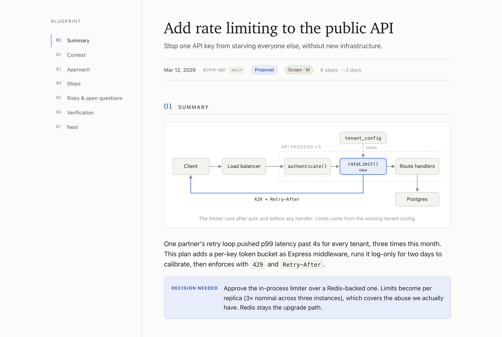

# Blueprint

Reading text in the terminal sucks, especially the super long plans agents write.

Stop reading your agent's plans in the terminal. Blueprint opens every plan as a beautiful HTML page in your browser: the decision up top, a diagram of how the pieces fit, numbered steps with the files each one touches. Same layout every time.



## Install

```sh
npx skills add dannyhamam/blueprint
```

Works with Claude Code, Cursor, Codex, and any agent that reads `SKILL.md`. Update with `npx skills update`.

Or by hand:

```sh
git clone https://github.com/dannyhamam/blueprint ~/.claude/skills/blueprint
```

## Use

Nothing to run. When the agent presents a plan, it writes a page to `~/.blueprint/` and opens it. That's outside your repo, so nothing shows up in `git status`.

To force it: `/blueprint`, or "blueprint this".

## Customize

Ask for one-off changes in plain words: "make this one dark", "denser", "bigger type". To change every plan, fork the repo and edit `templates/plan.html`.

## License

MIT
